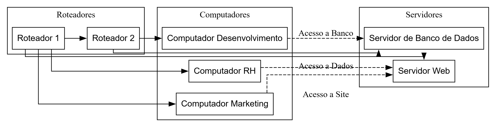

# Projeto: Infraestrutura de Rede e Servidores



## Descrição do Projeto
Este repositório apresenta a arquitetura de rede utilizada para conectar computadores, servidores e roteadores, com destaque para os fluxos de comunicação entre os diferentes componentes.

A infraestrutura ilustrada inclui:
- **Roteadores** para gerenciar a conexão entre os dispositivos.
- **Computadores** para Desenvolvimento, RH e Marketing.
- **Servidores** de Banco de Dados e Web para suporte às aplicações e acesso a dados.

## Estrutura do Repositório
Diagramas e Arquitetura:
DIAGRAMAREDE.png: Diagrama básico da infraestrutura de rede.
REDEBASICA.png: Representação visual detalhada da topologia de rede.
Screenshot.png: Fluxograma explicando o fluxo de dados na cooperativa.
Arquivos de Projeto:
REDEBASICAPROJETO.pkt: Arquivo do Cisco Packet Tracer com a configuração completa da rede.
Documentação:
doc.pdf: Guia com informações técnicas e explicações detalhadas sobre a infraestrutura.

## Como Usar
1. Clone o repositório:
   ```bash
   git clone https://github.com/seu-usuario/nome-repositorio.git
   ```
2. Analise o diagrama e leia a documentação para entender a estrutura.
3. Adapte as configurações de rede para o seu ambiente, conforme necessário.

## Tecnologias Utilizadas
- **Diagramação**: Ferramenta utilizada para criar o esquema da rede.
- **Protocolos**: Inclui protocolos como HTTP, HTTPS, e TCP/IP para comunicação.

## Contato
Para dúvidas ou colaborações, entre em contato:
- **Instagram**: [@jhenriqueoriginal](https://instagram.com/jhenriqueoriginal)

## Contribuição
Contribuições são bem-vindas! Siga as etapas abaixo:
1. Faça um fork do repositório.
2. Crie uma branch para a sua contribuição:
   ```bash
   git checkout -b minha-nova-feature
   ```
3. Submeta um Pull Request com uma descrição detalhada das alterações.

## Licença
Este projeto está licenciado sob a [Licença MIT](LICENSE).

---

Obrigado por visitar este repositório! 🙌


